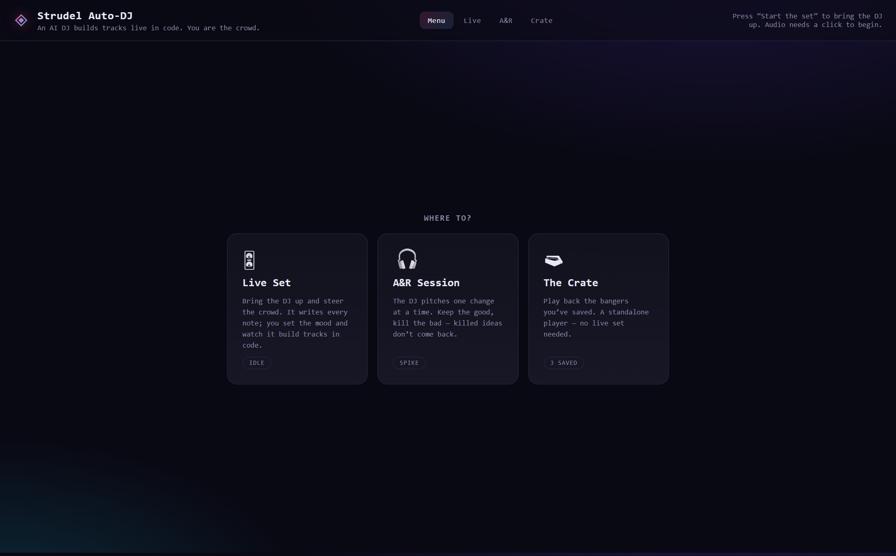
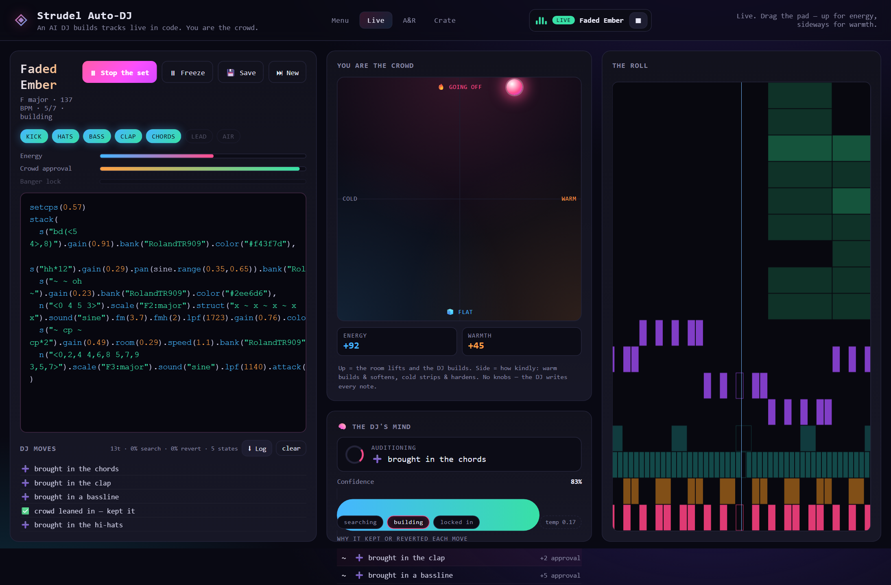
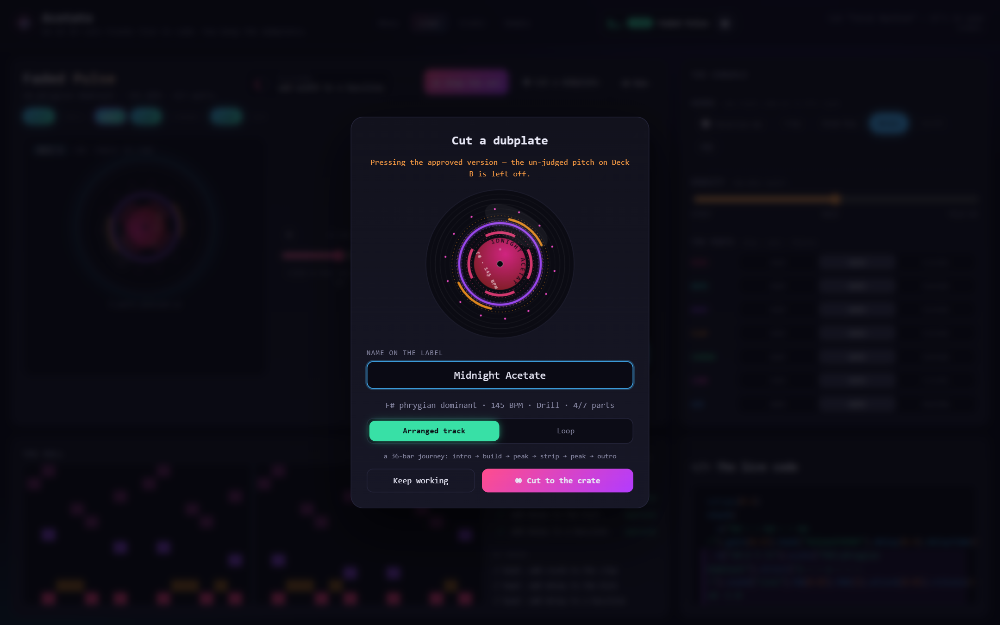
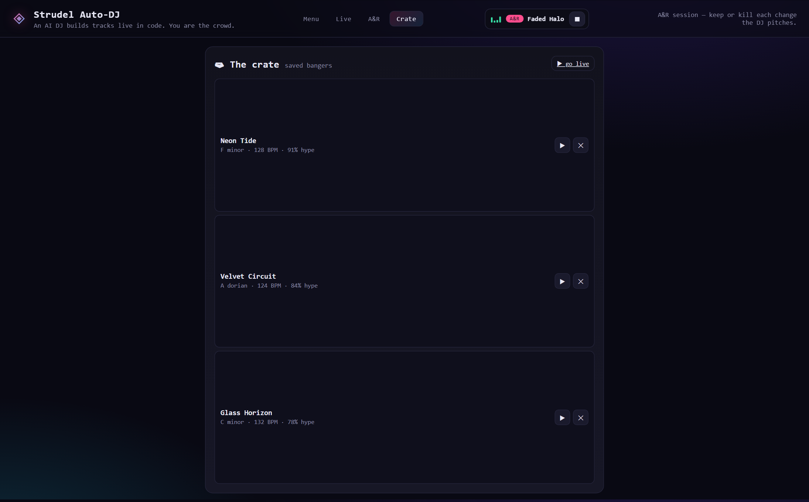
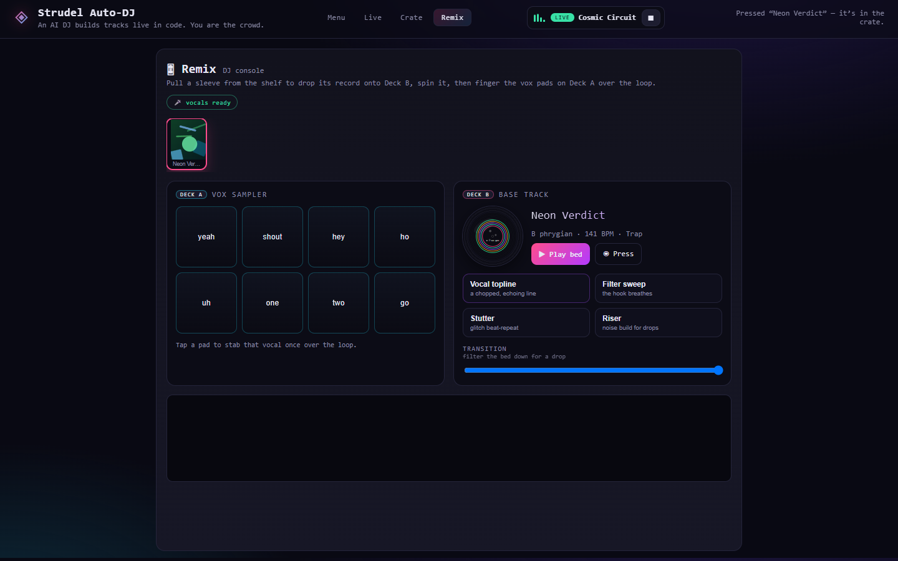

# Acetate 🎧



**Acetate** is a DJ that **cuts tracks live in [Strudel](https://strudel.cc) code**
while you steer, turn by turn. Built on [Strudel](https://strudel.cc)

**[▶ Play it live](https://luketheojohnson.github.io/acetate/)** &nbsp;·&nbsp;
No backend · no framework · no bundler · no build step &nbsp;·&nbsp; MIT-licensed




---

### 🎛 Live Set — two decks, one verdict at a time

Turn-based, and physical. The DJ **cuts one change at a time onto Deck B** as an acetate
test pressing — a translucent disc in the touched part's colour, wearing the kind of change
(`+` new part, `−` drop, `≈` rework, `✦` effect, `≡` double, `▲` fill). The committed track
spins on **Deck A**, its record filling with a coloured ring per approved part.

The bit that matters: the **crossfader** between the decks drives `engine.renderAB(mix)` —
one balanced Strudel program that carries *both* versions of the touched lane at
complementary gains. Slide it and you literally hear the change blend in and out against
the current track before you judge it. **✓ Approve** presses the change onto the record;
**✗ Skip** bins it (a skipped instrument stays out for the song).

The **console** on the right biases what gets pitched next — genre pills, a density dial,
and a per-part channel strip (drop / auto / feature). Below, **the roll** (Strudel's own
[`.pianoroll()`](https://strudel.cc/learn/visual-feedback/)) scrolls the notes with each
layer on its own coloured lane, next to a compact set history. The live code still exists —
tucked into a `</>` drawer, with the pitched lane's lines tinted.

### ◉ Cutting — saving cuts a dubplate

When the arrangement is full (or you hit **◉ Cut a dubplate** any time), the press modal
opens: the disc spins with its accreted colours, you **imprint the name on the label**
(it updates live as you type), and the modal states exactly **which version is banked** —
always the *approved* track; an un-judged pitch on Deck B is left off
(`engine.renderCommitted()`). Pick a format — **Arranged track** (the default: a 36-bar
journey, intro → build → peak → kickless strip → peak → outro, with snare builds at the
section turns) or **Loop** (the raw bar as it plays) — confirm, and the record drops into
the crate wearing its approve-rate. From the save prompt, the DJ then rolls a fresh track.



### 🗃 The Crate

A standalone player and your vault. Every saved track is a full **dubplate** with a vinyl face,
genome snapshot, cover seed, and metadata persisted in `localStorage` and portable via
Export/Import JSON. Spin, imprint the label, send
to Remix, **export to MP3** (⬇ — a real-time render captured and encoded in-browser), or
delete. Because every track is seeded, a record's code is fully reproducible.



### 🎚 Remix — DJ your own records

Pull two **sleeves** from the shelf onto **Deck A** and **Deck B** and the discs drop onto
the platters. A **32-bar phrase timeline** is the clock: **ARM** a transition and it fires
quantised on the next 8/16/32-bar line (slam or auto-fade). Each deck splits into **stems**
(drums · bass · chords · lead · air) you can mute, solo or **swap** across decks, each with
its own filter sweep; three **hold-to-fire paddles** (stutter / gate / echo) ride the master
over an equal-power crossfader. Press the blend and it banks as a new dubplate.



---

## Run it

Static site, **no build step** — just serve the folder over HTTP (audio and ES features
want a real origin, not `file://`):

```bash
python serve.py 8124        # preferred: sends Cache-Control: no-store
# then open http://localhost:8124
```

> **Why `serve.py` and not `python -m http.server`?** The stdlib server sends no
> cache headers, so browsers heuristically cache `src/*.js` and keep serving *old* code
> after you edit — you refresh and hear the previous build. `serve.py` disables caching.
> If you use the plain server, keep DevTools open with **Network → Disable cache** ticked.

Click **▶ Start the set** (a click is required to unlock browser audio). First load pulls
the Strudel engine + a drum kit from the CDN, so you need to be online the first time.

### Deploy (GitHub Pages)

Because it's a build-free static site, GitHub Pages serves it as-is. One-time setup:
**Settings → Pages → Source: Deploy from a branch → `master` → `/ (root)` → Save**. Every
push then publishes to `https://<user>.github.io/<repo>/`. No workflow, no build.

---

## How the DJ thinks

The engine (`src/dj.js`) keeps the track as a **genome** — which layers are on, each
layer's variant, per-lane FX/double flags, a fill, an energy gene and a drum-machine gene.
The Live set drives it turn-based: `proposeChange()` applies one weighted mutation for you
to judge, `acceptChange()` keeps it, `rejectChange()` reverts it and bans the idea for the
song (killed *reworks* are only spaced out, so the session never dead-ends). The console's
genre/density/part-mixer state biases the candidate weights.

The engine also keeps the sound genre-honest as it builds: trap and drill open with the
808 already seeded (drill's slides via a patterned pitch envelope), lo-fi and boom bap
drums swing, the lead is always filtered, and **energy ramps with the part count** — a
fuller arrangement plays hotter, unlocking busier hats, open-hat accents and lead delay.

Three renders matter:

- `renderAB(mix)` — the committed and proposed versions of the touched lane in one
  balanced `stack(...)`, at gains `(1-mix)` / `mix` (chained `.gain()` multiplies in
  Strudel). This is what the crossfader evaluates.
- `renderCommitted()` — the approved track only, rendered from the pre-pitch snapshot.
  This is what a save banks, always.
- `renderArranged()` — the committed genome as a 36-bar `arrange(...)` journey; the
  pressing modal's "Arranged track" format. This is the shippable render.

The original crowd-fader optimiser (`tick()` — hill-climbing on approval with tabu +
simulated annealing) still lives in the engine and stays test-covered.

---

## Architecture

Plain classic scripts sharing a `window.SDJ` namespace, loaded in dependency order in
`index.html` (`rng → theory → names → dj → viz → log → art → vinyl → menu → app`). No ES
modules — it keeps the thing serverless-simple and robust on Windows.

```
index.html        the four views + the pressing modal + loads Strudel and the modules
serve.py          tiny dev server that disables caching (no stale JS)
styles.css        dark neon club theme: deck rig, console, press modal, crate, remix
src/rng.js        seeded PRNG + helpers (reproducible tracks)
src/theory.js     scales, keys, chord progressions, drum banks
src/names.js      track-title generator
src/dj.js         the brain: genome, proposeChange/accept/reject, renderAB/renderCommitted
src/viz.js        the original dancing-crowd canvas (retired; kept, dormant)
src/log.js        structured, exportable set-log for diagnosing the engine
src/art.js        deterministic generative square covers (the remix shelf's sleeves)
src/vinyl.js      the record itself: deterministic SVG discs, acetates, live labels
src/menu.js       the signal-bloom menu canvas
src/app.js        wiring: decks + crossfader, pressing flow, transport, crate, remix
test/app_test.js  headless jsdom integration test (Strudel audio stubbed, seeded engine)
```

Data flow (Live): `approve/skip → engine genome → render/renderAB → evaluate → audio`,
with the same rendered string driving the code drawer and the pianoroll, and
`SDJ.Vinyl.forLive(...)` drawing the committed genome as the record on Deck A.

Everything the UI can do is also exposed headlessly for agents and tests:
`SDJ.live.approve/skip`, `SDJ.ab.set(mix)`, `SDJ.press.open/confirm/cancel`,
`SDJ.setGenre/setDensity/setOpinion`, `SDJ.remix.*`, `SDJ.exportMp3(i)` and
`SDJ.menuAmbient.start/stop`.

---

## Tests

The app needs no dependencies to run; the suite uses `jsdom` to exercise the wiring end to
end (boot → start → pitch/judge → A/B blending → pressing → crate → remix → export) with
Strudel's audio globals stubbed and the engine seeded so runs are deterministic:

```bash
npm install   # installs jsdom (dev-only)
npm test      # 88 checks
```

---

## Tuning

Most of the "feel" lives in `src/dj.js`:

- `STAGES` — the arrangement layers and the order they build in.
- `proposeChange()` — the candidate moves and their weights (what the DJ pitches).
- `renderAB()` / `renderCommitted()` / `renderArranged()` — the deck blend, the save
  semantics, and the section plan of the arranged track.
- `effEnergyIdx()` — how energy ramps with the build (the floor per part count).
- `MIN_FULL` (in `app.js`) — how full a track must be before the press prompt appears.
- `render()` — the actual Strudel each layer emits (sounds, filters, effects, lane colours).

The **⬇ Log** button in the set history exports the full set trace as JSON — handy for
tuning the engine from real sessions.

---

## Notes / limits

- Drums use a kit loaded from the CDN by `initStrudel()`; the synth layers
  (`sawtooth`/`square`/`triangle`/`sine`) always play, so a track is never silent.
- Generated Strudel is built by string concatenation and is kept **valid and balanced** —
  the test checks paren/quote balance across every render, including mid-fader blends.
- The pianoroll is Strudel's own visualiser (already in the `@strudel/web` bundle) — no
  extra dependency. It's appended only to the *audio* string, never to the saved/shown code.
- Vinyl discs are pure deterministic SVG (`src/vinyl.js`) — same seed, same record,
  everywhere it appears. No assets, no network.
- MP3 export renders the track in real time and encodes it in-browser (lamejs, fetched
  on demand) — so a save is as long as the track, and the encoder loads once per session.
- The screenshots above are captured headless via Playwright (throwaway script, not
  committed).

---

## Licence

This project's own source is **MIT** — see [LICENSE](LICENSE). It loads the
[Strudel](https://strudel.cc) live-coding engine at runtime from a CDN; Strudel is not
bundled or modified here and remains under its own licence (AGPL-3.0).
