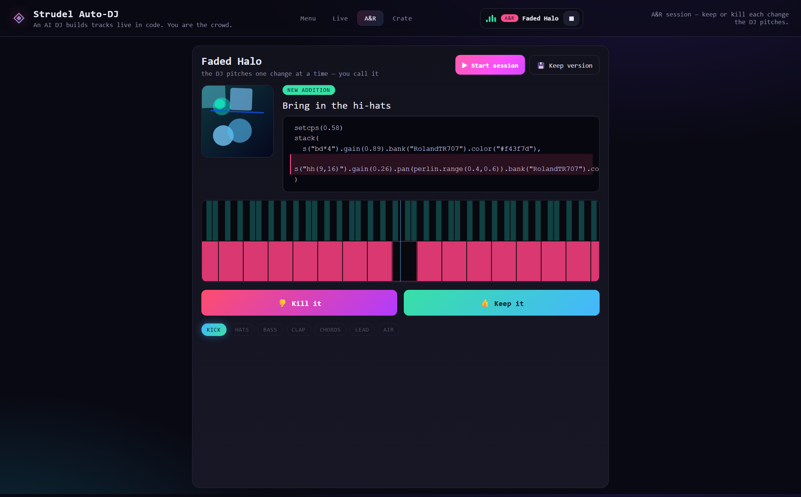

# Strudel Auto-DJ 🎧

An AI DJ that **writes and evolves tracks live in [Strudel](https://strudel.cc) code**
while you play the crowd. It authors every note; you only supply *taste*. Steer the room
and the DJ rewrites its own program in real time — building layers up, stripping them
back, chasing a groove — and when a full track holds the crowd it locks in a **banger**,
banks it, and starts fresh.

No backend, no framework, no bundler, no build step. Strudel is loaded from a CDN and the
whole thing is a handful of plain scripts sharing one `window.SDJ` namespace.


---

## Three ways to play

The app is one page with four hash-routed views (**Menu · Live · A&R · Crate**). Audio is
a single source at a time, with one **⏹ stop** in the header that halts whatever's playing.


### 🎛 Live Set — steer the crowd

You don't touch knobs. You drag a **two-axis crowd pad**:

- **Up ↕ (energy)** — flat ↔ going off. This is the DJ's reward: it climbs it.
- **Sideways ↔ (warmth)** — cold ↔ warm. This only colours *how* it searches: warm builds
  and softens, cold strips and hardens.

The DJ reads the room, mutates the arrangement, and shows its work:

- the **live Strudel code** it's playing, syntax-highlighted and flashing on each change;
- **the DJ's mind** — whether it's auditioning or holding, its confidence/temperature, and
  a running feed of *why* it kept or reverted each move;
- **the roll** — Strudel's own [`.pianoroll()`](https://strudel.cc/learn/visual-feedback/)
  guitar-hero scroller, with each layer on its own coloured lane.

### 🎧 A&R Session — keep or kill

A different way to steer: no pad, turn-based. The DJ **pitches one change at a time** — a
new layer or a rework — and you **👍 keep** or **👎 kill** it. Each pitch comes with a
generative cover, a plain-English line, the exact code lines it touches (highlighted), and
its own pianoroll so you can hear/see the idea before you call it.

Killed **instruments** stay out for the song; killed **reworks** are just set aside for a
while — so the DJ never runs out of ideas and the session doesn't dead-end.



### 🗃 The Crate — your saved bangers

A standalone player. Anything the crowd approved (or you saved by hand) lands here and
persists in `localStorage`. Preview or delete any of them — no live set required. Because
every track is seeded, a saved track's code is fully reproducible.


---

## Run it

Static site, **no build step** — just serve the folder over HTTP (audio and ES features
want a real origin, not `file://`):

```bash
python serve.py 8124        # preferred: sends Cache-Control: no-store
# then open http://localhost:8124
```

> **Why `serve.py` and not `python -m http.server`?** The stdlib server sends no
> cache headers, so browsers heuristically cache `src/*.js` and keep serving *old* code
> after you edit — you refresh and hear the previous build. `serve.py` disables caching.
> If you use the plain server, keep DevTools open with **Network → Disable cache** ticked.

Click **▶ Start the set** (a click is required to unlock browser audio), then drag the pad.
First load pulls the Strudel engine + a drum kit from the CDN, so you need to be online the
first time.

---

## How the DJ thinks

The engine (`src/dj.js`) is an **online hill-climber** over the space of arrangements with a
single fitness function: *sustained crowd approval*. The track is a **genome** — which
layers are on, each layer's variant, an energy gene and a drum-machine gene. Every trial
window it:

1. **proposes** a mutation (add/drop a layer, reshape one, swap the kit, swing the energy,
   or — when it's been going nowhere — throw a *curveball*: a new progression, kit or scale);
2. **auditions** it for a few seconds;
3. **judges** it purely by the change in approval — rose → keep, fell → revert (but
   sometimes *gamble* and keep it), flat → keep exploring.

Two mechanisms keep it out of ruts (the classic add-it/drop-it/add-it loop):

- a **tabu list** — a just-toggled layer is off-limits for a few proposals;
- **simulated-annealing acceptance** — a rising *temperature* (approval falling makes the DJ
  search harder and wider, not shrink to silence) occasionally keeps a worse move to climb
  out of a local rut, and boredom triggers a curveball for genuine novelty.

`render()` compiles the genome to an idiomatic Strudel `stack(...)` of `s(...)` /
`n(...).scale(...)` layers, each tinted with `.color()` so it gets its own pianoroll lane.
The code you see is exactly what's playing — it re-evaluates only when the genome's
signature actually changes, so small pad moves don't thrash the audio.

The **A&R** mode reuses the same genome/render, but the human is the fitness function:
`proposeChange()` / `acceptChange()` / `rejectChange()` instead of the mood signal.

---

## Architecture

Plain classic scripts sharing a `window.SDJ` namespace, loaded in dependency order in
`index.html` (`rng → theory → names → dj → viz → log → art → app`). No ES modules — it
keeps the thing serverless-simple and robust on Windows.

```
index.html        the four views + loads Strudel and the modules
serve.py          tiny dev server that disables caching (no stale JS)
styles.css        dark neon club theme
src/rng.js        seeded PRNG + helpers (reproducible tracks)
src/theory.js     scales, keys, chord progressions, drum banks
src/names.js      track-title generator
src/dj.js         the brain: genome, the optimiser (tick), A&R moves, code generation
src/viz.js        the original dancing-crowd canvas (retired; kept, dormant)
src/log.js        structured, exportable set-log for diagnosing the engine
src/art.js        deterministic generative cover art for A&R pitches
src/app.js        wiring: Strudel init, the evolution loop, the pad, transport, rolls, crate
test/app_test.js  headless jsdom integration test (Strudel audio stubbed)
```

Data flow (Live): `crowd pad → engine.tick → (if changed) engine.render → evaluate → audio`,
and the same rendered string drives the code panel and the pianoroll.

---

## Tests

The app needs no dependencies to run; the suite uses `jsdom` to exercise the wiring end to
end (boot → start → live evaluation → evolution → banger detection, plus the A&R keep/kill
flow) with Strudel's audio globals stubbed:

```bash
npm install   # installs jsdom (dev-only)
npm test      # 37 checks
```

---

## Tuning

Most of the "feel" lives in `src/dj.js`:

- `STAGES` — the arrangement layers and the order they build in.
- `proposeMutation()` / `tick()` — how mood becomes build/strip/mutate decisions, the tabu
  life, the boredom threshold and the annealing.
- `HIT_SECONDS`, `LOCK_APPROVAL`, `MIN_FULL` — how long the crowd must stay hyped on a full
  track before it counts as a banger.
- `render()` — the actual Strudel each layer emits (sounds, filters, effects, lane colours).

The header **⬇ Log** button exports the full set trace as JSON — handy for tuning the engine
from real sessions.

---

## Notes / limits

- Drums use a kit loaded from the CDN by `initStrudel()`; the synth layers
  (`sawtooth`/`square`/`triangle`/`sine`) always play, so a track is never silent.
- Generated Strudel is built by string concatenation and is kept **valid and balanced** —
  the test checks paren/quote balance across every stage.
- The pianoroll is Strudel's own visualiser (already in the `@strudel/web` bundle) — no
  extra dependency. It's appended only to the *audio* string, never to the saved/shown code.
- The screenshots above are captured headless via Playwright (`_`-prefixed helper, not
  committed).
